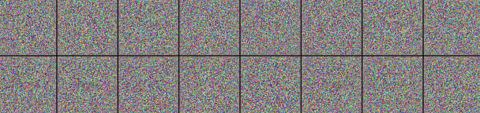

 Catdog by CCGAN
 ==
 <table>
    <tr><th>Tags</th><th>Techs</th><th>Status</th></tr>
    <tr>
        <td>    
                 </td>
        <td>  </td>
        <td>  </td>
    </tr>
</table>
 Generating images of ***Catdog*** by Conditional-Convolutional-GAN
 
 Results
 --
 @ Epoch: 10
 

