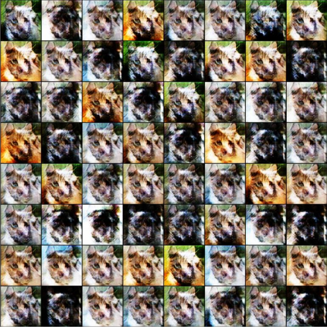
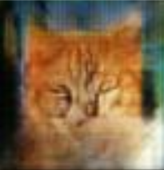
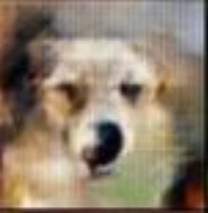
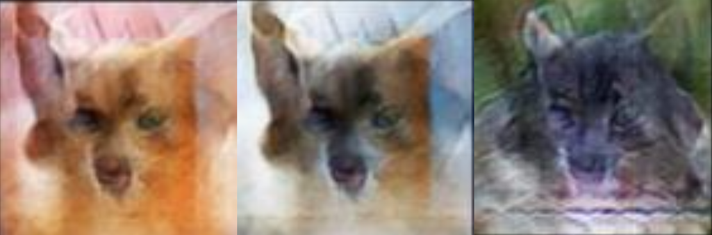

 Catdog by CCGAN
 ==
 

<table>
    <tr><th>Tags</th><th>Techs</th><th>Status</th></tr>
    <tr>
        <td>    
                 </td>
        <td>  </td>
        <td>  </td>
    </tr>
</table>

Generating images of ***Catdog*** by Conditional-Convolutional-GAN
 
Results
--
### Epochs: 10

### Epochs: 100

### Epochs: 500

<table align="center">
<tr>
    <th>Cat</th>
    <th>Dog</th>
    <th>Catdog</th>
</tr>
<tr>
    <td></td>
    <td></td>
    <td></td>
</tr>
</table>